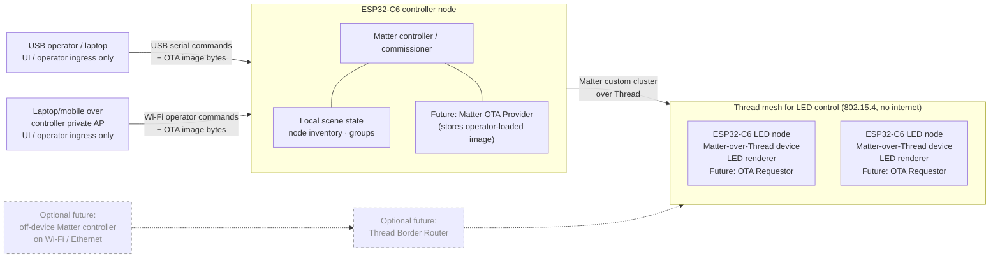

# Architecture

LED Orchestra is a distributed, fully offline LED renderer. Each ESP32-C6 LED
node owns one physical strip segment. A dedicated ESP32-C6 controller node owns
the show state, acts as the Matter controller/commissioner, and sends commands
to the LED nodes over an offline Thread mesh.

The first prototype needs no venue Wi-Fi, no cloud, and no internet. Operator
ingress is USB serial plus the controller's private Wi-Fi AP for laptop/mobile
convenience. In both cases, the laptop/phone is only operator input; it is not
the Matter controller. See
[Roles And Responsibilities](#roles-and-responsibilities) for the precise split
between the operator UI, the Matter controller, the Thread Border Router, and
the OTA roles, because the word "controller" is otherwise easy to overload.

## Project Layout

| Path | Role |
| --- | --- |
| `matter-prototype/` | ESP-IDF/ESP-Matter prototype lane for Thread LED nodes, a dedicated controller node, custom cluster, and offline OTA. |
| `matter-prototype/led-node/` | C++ LED-node app that exposes the LED Orchestra custom cluster and renders one physical strip segment. |
| `matter-prototype/controller-node/` | C++ controller/commissioner app with USB serial ingress and controller-local Wi-Fi ingress. |
| `matter-prototype/common/` | Shared C++ constants for the custom cluster and effect ids. |

The completed Rust WiFi/UDP Phase 1/2 implementation is archived on the
`archive/rust-phase-2` branch. `main` should stay focused on the C++
ESP-IDF/ESP-Matter path.

## Roles And Responsibilities

These are five distinct concepts. The prototype deliberately collapses most of
them onto the ESP32-C6 controller node, but they are *not* the same thing and
should not be conflated in code or docs.

| Role | What it is | Where it lives in the offline prototype |
| --- | --- | --- |
| **UI / operator ingress** | The surface a human uses to express intent (set a scene, provision a node, load an OTA image). It carries operator commands; it holds no Matter identity. | USB serial and controller-local Wi-Fi. The controller currently defaults to a private operator AP whose SSID/password are set in the gitignored `sdkconfig.defaults.local`. It is **not** the Matter controller. |
| **Matter controller / commissioner** | The Matter fabric admin: it commissions LED nodes, holds fabric credentials, sends cluster commands, and is the local source of truth for scenes, node inventory, groups, and OTA images. | The dedicated **ESP32-C6 controller node**. |
| **Thread Border Router (TBR)** | A device that routes between a Thread mesh and another IP network (Wi-Fi/Ethernet). | **Not required** for the offline prototype. See the open risk below. |
| **Matter OTA Provider** | The node that stores a firmware image and serves it to requestors over the Matter fabric. | The **controller node** (Phase 6). The image arrives over USB from the operator first. |
| **Matter OTA Requestor** | A node that asks the provider for, downloads, and applies a firmware image. | Each **LED node** (Phase 6). |

Key clarifications:

- The laptop/phone is only operator input. It does **not** need to be a Matter
  controller, run a Matter app, or hold fabric credentials. It reaches the
  controller node over USB serial or the controller's private Wi-Fi AP; the
  controller node translates intent into Matter cluster commands.
- The ESP32-C6 controller node is the Matter controller/commissioner and the
  local source of truth. It works with no venue network or internet.
- A Thread Border Router is only needed if (a) the Matter controller is moved
  onto a separate IP/Wi-Fi/Ethernet network instead of being embedded on the
  ESP32-C6, or (b) hardware validation shows ESP-Matter cannot run a Thread-only
  embedded controller on ESP32-C6 and requires an explicit OpenThread
  border-router role for the controller path. This is an open risk
  ([see below](#open-design-choices)), not a current requirement.
- Matter fabric credentials and firmware-image signing/encryption are
  **separate security layers**. Fabric credentials authorize who may talk on the
  Matter fabric; image signing/encryption authorizes what firmware a node will
  accept. Neither replaces the other.

### Offline Prototype Topology



Everything inside the solid boxes keeps the controller node as the only Matter
controller for LED nodes. Wi-Fi, when enabled, is only an operator ingress path
to the controller node; LED nodes remain controlled over Thread/Matter. The
dashed nodes are optional future architecture and are not added to Phase 3.

## Runtime Model

The installation behaves as one virtual strip:

```text
virtual index space: 0 ........................................ total_leds - 1
node 1 segment:      [0, 60)
node 2 segment:              [60, 120)
node 3 segment:                         [120, 180)
```

Each node renders only its own contiguous segment. Effects still receive the
global LED index, so a rainbow or wave can flow across board boundaries.

## Command Flow

```text
operator UI (USB or controller-local Wi-Fi) -> controller node (Matter controller) -> Matter custom cluster over Thread -> LED nodes -> LEDs
```

Two splits matter here:

- **UI ingress vs. controller.** The laptop/mobile is only the operator UI. It
  hands intent to the controller node over USB serial or controller-local Wi-Fi.
  The controller node is the Matter controller that decides what should happen
  and emits cluster commands.
- **Controller vs. nodes.** The controller node decides the scene; LED nodes
  render it and keep rendering the last valid scene locally if Thread contact
  drops.

No part of LED-node control requires venue Wi-Fi, Ethernet, a cloud service, or
the internet. Controller-local Wi-Fi is a convenience ingress to the controller
node only; it is not LED-node transport.

## Transport Strategy

- Matter is the application/security/controller model.
- Thread/OpenThread is the offline IPv6 mesh carried by the ESP32-C6 802.15.4
  radio.
- ESP-Matter is ESP-IDF/C++ oriented, so Phase 3 onward is implemented in C++.
- FastLED is the intended rendering/effect library after an ESP32-C6 +
  ESP-Matter integration spike proves the build/runtime path.
- The first Matter fabric is private development only, with generated
  per-device factory data and test/dev credentials.

## Rendering Invariants

- Effects are pure functions of `(global_index, time_ms, params, context)`.
- Nodes do not need per-effect mutable state to stay visually aligned.
- Every production LED node is ESP32-C6.
- Effect ids are append-only and remain stable across Matter commands and OTA
  updates.
- The controller resolves priority before nodes render.
- Firmware keeps the last valid scene if a bad command arrives or network
  contact is lost.

## Override Priority

The planned priority chain is:

```text
emergency > segment > group > global
```

Phase 5 should resolve this chain in the controller, then send a plain
`ActiveScene`-equivalent command to each affected node. That keeps firmware
small and predictable.

## Matter Custom Cluster

The Matter/Thread prototype uses a vendor custom cluster instead of trying to
fit LED Orchestra behavior into standard light clusters.

Prototype cluster id: `0xFFF1FC00`.

First commands:

- `SetScene`: effect id, color, speed, brightness, sequence, and scheduled
  start time.
- `SetNodeConfig`: node id, segment range, total LED count, and LED GPIO.
- `SyncClock`: controller time for scheduled scene alignment.

First status attributes:

- Current scene.
- Segment config.
- Firmware version.
- Last accepted sequence.
- Last controller time.

Use Matter group/multicast for all-node scene changes after at least two nodes
are commissioned. Keep provisioning and per-node config unicast-only.

## Offline OTA Flow

OTA stays fully offline and uses the same role split as scene control (Phase 6
target):

```text
operator (laptop/mobile)
  -> USB serial or controller-local Wi-Fi: signed + encrypted firmware image bytes
  -> controller node: stores the image, acts as Matter OTA Provider
  -> Matter OTA over Thread
  -> LED nodes: Matter OTA Requestors download + verify + apply
```

- The operator loads a **signed and encrypted** firmware image over USB serial
  or controller-local Wi-Fi. The laptop/phone is still only ingress; it never
  joins the Matter fabric.
- The controller node stores the image and serves it as the local Matter OTA
  Provider over the offline fabric. No image is fetched from the internet.
- Each LED node is a Matter OTA Requestor: it downloads the image from the
  provider, verifies the signature, decrypts it, and applies it, with USB
  flashing kept as the recovery path.
- **Two independent security layers:**
  - *Matter fabric credentials* decide who may participate in the fabric and
    invoke the OTA cluster.
  - *Firmware image signing/encryption* decides which firmware a node will
    accept and run.
  A valid fabric member still cannot push firmware a node will not verify, and a
  correctly signed image still cannot be delivered by a non-fabric device.

## Adding An Effect

1. Add a stable C++ effect id at the end of the effect-id list.
2. Add the LED-node renderer implementation, preferably using FastLED once the
   integration spike is accepted.
3. Add controller command parsing/help if the effect needs new parameters.
4. Keep the Matter custom-cluster command contract stable unless the new effect
   truly needs new fields.
5. Build both ESP-IDF apps and validate the effect on physical LEDs.

Do not reorder or reuse wire ids. Nodes and controllers may be updated at
different times, especially after OTA support exists.

## Open Design Choices

- **Open hardware risk:** whether ESP-Matter supports a Thread-only *embedded*
  Matter controller on ESP32-C6, or whether the controller path needs an
  explicit OpenThread Border Router role even though the system is fully
  offline. Hardware validation in Phase 3 must confirm this. If a border-router
  role turns out to be required, it is an implementation detail of the
  controller node, not a reason to add Wi-Fi, a phone app, or the internet.
  - *Bring-up evidence (Phase 3):* the operator Wi-Fi AP must be a standalone
    `esp_wifi` softAP. CHIP's `ENABLE_WIFI_AP`/`ENABLE_WIFI_STATION` are kept off
    so the Matter connectivity manager does not seize the radio and stop the AP.
    With CHIP Wi-Fi off and no Thread SRP server / border router on the fabric
    yet, Matter DNS-SD advertising over IP fails at boot
    (`chip[DIS]: Failed to advertise ... : 3`). Offline Thread discovery is
    expected to ride Thread SRP, so this failure is a concrete pointer at whether
    an SRP-server/border-router role is needed on the controller. Resolve or
    explain this while validating commissioning over BLE+Thread.
- Exact Matter vendor id/product id and cluster ids for production.
- Durable storage layout for Matter-provisioned `NodeConfig`.
- OTA image storage limits on the controller node, and the operator transport
  for loading images (USB serial or controller private AP for laptop/mobile
  upload).
- Operator UX after the USB serial prototype proves stable, including the exact
  controller-local Wi-Fi shape (private AP vs. joining a private local network).
