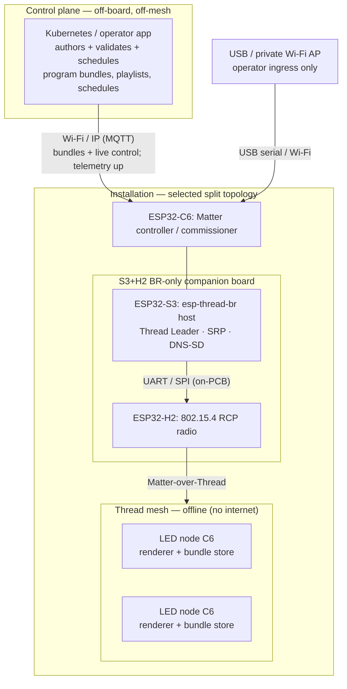

# Architecture

LED Orchestra is a distributed LED renderer. Each ESP32-C6 LED node owns one
physical strip segment; together the segments form one virtual strip. The LED
nodes are Matter-over-Thread devices driven by a controller over an offline
Thread mesh.

The LED control path is fully offline: no venue Wi-Fi, no cloud, and no internet
are required to render scenes. A Kubernetes control plane authors and schedules
shows and pushes them to the controller over an IP link, but the live show keeps
running without it. The word "controller" is easy to overload, so see
[Roles And Responsibilities](#roles-and-responsibilities) for the precise split
between the control plane, the Matter controller, the Thread Border Router, the
RCP radio, and the LED nodes.

The production controller/border-router topology was a **validation-gated**
decision; the canonical statement lives in
[`controller-topology-adr.md`](controller-topology-adr.md) and the experiment
that decides it in
[`controller-topology-validation.md`](controller-topology-validation.md). This
file describes the system those documents converged on.

## Project Layout

| Path | Role |
| --- | --- |
| `matter-prototype/` | ESP-IDF/ESP-Matter lane for Thread LED nodes, the controller, the custom cluster, and offline OTA. |
| `matter-prototype/led-node/` | C++ LED-node app: exposes the LED Orchestra custom cluster and renders one strip segment. |
| `matter-prototype/controller-node/` | C++ controller/commissioner app for the **separate ESP32-C6 controller** used in the selected split topology. |
| `matter-prototype/common/` | Shared C++ constants for the custom cluster and effect ids. |
| `matter-prototype/cluster/` | Human-readable custom-cluster contract. |
| `matter-prototype/s3-h2-hub-validation/` | S3+H2 one-board hub runbooks + committed config (the primary hub validation; Stages A-F). |
| `matter-prototype/stage0-br-validation/` | Stage 0 all-C6 BR runbook + evidence (now the Fallback-1 validation). |

The completed Rust Wi-Fi/UDP Phase 1/2 implementation is archived on the
`archive/rust-phase-2` branch. `main` carries only the C++ ESP-IDF/ESP-Matter
path; there is no `firmware/` (Rust) tree on `main`.

## Roles And Responsibilities

These are distinct concepts. Earlier prototypes collapsed several of them onto
one ESP32-C6, which is exactly what failed (see
[`debugging-journal.md`](debugging-journal.md)). They must not be conflated in
code or docs.

| Role | What it is | Where it lives |
| --- | --- | --- |
| **Control plane (Kubernetes)** | Authors program bundles, playlists, and schedules; validates and stores the master library; the heavy logic. Talks **only** to the controller/hub over IP. | Off-board: a Kubernetes cluster / operator app. Never on a C6, never on the Thread mesh. |
| **UI / operator ingress** | The surface a human/automation uses to express intent. Carries commands and bundle bytes; holds no Matter identity. | USB serial, the controller's private Wi-Fi AP, and the Kubernetes link. **Not** the Matter controller. |
| **Matter controller / commissioner** | The fabric admin: commissions LED nodes, holds fabric credentials, sends cluster commands, resolves scene/group/priority, caches approved bundles, relays them over Matter. | A **separate ESP32-C6 controller node** in the selected split topology. The control plane does the heavy lifting; the controller stays a thin device gateway. |
| **Thread Border Router (OTBR)** | Owns the Thread network and DNS-SD/SRP; routes IPv6 between the IP side and the mesh. **Required** — a single infra-less C6 cannot self-resolve operational nodes. | `esp-thread-br` **host on the ESP32-S3 + ESP32-H2 RCP**, used as a **BR-only** companion board in the selected split topology. |
| **RCP (radio co-processor)** | A dedicated 802.15.4 radio driven by the border-router host over UART/SPI. | The **ESP32-H2** on the S3+H2 board (an RCP C6 in the all-C6 fallback). |
| **Matter OTA Provider** | Stores a firmware image and serves it over the fabric. | The **S3 hub** (the OTA phase). The image arrives over USB or the Kubernetes link first. |
| **Matter OTA Requestor** | Asks the provider for, verifies, and applies a firmware image. | Each **LED node** (the OTA phase). |
| **LED node** | A Thread-only Matter device that renders one strip segment and can store program bundles for autonomous scheduled playback. | Each **LED node C6**. |

Key clarifications:

- **The control plane talks only to the controller/hub.** Kubernetes never
  reaches an LED node directly. LED nodes stay Thread-only and never join Wi-Fi.
- **A real border router is required, not optional.** This was an open risk; it
  is now closed by hardware evidence (see
  [Controller / Border-Router Topology](#controller--border-router-topology) and
  [`debugging-journal.md`](debugging-journal.md)).
- **LED control never rides Wi-Fi.** Wi-Fi/IP carries only Kubernetes ingress and
  telemetry. Controller→LED commands always travel Matter-over-Thread.
- **Fabric credentials and image signing are separate security layers.** Fabric
  credentials authorize who may talk on the Matter fabric; image (and bundle)
  signing authorizes what a node will accept. Neither replaces the other.

## Controller / Border-Router Topology

The 2026-06-02 bring-up proved a single ESP32-C6 acting as Matter commissioner
**and** its own infra-less SRP/DNS-SD owner cannot resolve its own operational
nodes (`dns browse` → `Error 28: ResponseTimeout`). The fix is a real OpenThread
Border Router. The later one-board S3+H2 hub experiment also failed its offline
co-located gate, so the selected topology is:

| Topology | Role |
| --- | --- |
| **Selected** | **S3+H2 board as BR-only + separate ESP32-C6 controller + Thread-only C6 LED nodes**. The controller lives on its own C6; the S3 hosts `esp-thread-br`; the H2 is the RCP. Control still rides Thread/Matter, never Wi-Fi. |
| **Fallback 1** | Controller C6 + BR-host C6 + RCP C6 (= the proven **Stage 0** config). Historical proven backup if the S3+H2 BR-only split ever proves unstable. |
| **Fallback 2** | Pi/Linux `ot-br-posix` + RCP/dongle. Final fallback only if the Espressif BR path itself is not stable. |

The former all-C6 *co-located* Hub C6 + RCP C6 is **superseded**; the single
infra-less C6 (Option 1) is ruled out. See
[`controller-topology-adr.md`](controller-topology-adr.md).

The gate is quantitative (heap, fragmentation, soak uptime, reboot recovery,
discovery success at 20-node scale, flash headroom). **Stage 0 (all-C6) PASSED on
2026-06-04** — a separate Thread client resolved an LED node through the BR, and
operational CASE + `SetScene` rendered. The decisive step for the S3+H2 hub is the
one-node end-to-end gate (commission → resolve through the BR → CASE → render).
Full rationale and the staged experiment:
[`controller-topology-adr.md`](controller-topology-adr.md),
[`controller-topology-validation.md`](controller-topology-validation.md).

## System Topology

For the **Thread mesh** view — 802.15.4 links, OTBR split, protocol stack, and
join/control sequence — see [`mesh-network.md`](mesh-network.md).



Everything that touches LED rendering stays on Matter-over-Thread. Wi-Fi/IP only
connects the control plane and operator ingress to the hub. The all-C6 split and
Pi fallbacks move boxes around (see the ladder above) but keep this same control
path on Thread.

## Runtime Model

The installation behaves as one virtual strip:

```text
virtual index space: 0 ........................................ total_leds - 1
node 1 segment:      [0, 60)
node 2 segment:              [60, 120)
node 3 segment:                         [120, 180)
```

Each node renders only its own contiguous segment. Effects receive the global LED
index, so a rainbow or wave flows across board boundaries.

## Program Distribution

Kubernetes authors and validates **program bundles** — declarative playlists of
`(effect_id, params, timing)` plus schedules — over the stable, append-only
compiled effect-id registry. Bundles are **data, not code**: new effect behavior
still ships as compiled firmware via Matter OTA (the OTA phase). Runtime-uploaded
effect scripts/plugins remain a separate future design.

```text
Program / playlist / schedule updates:
Kubernetes -> Wi-Fi/IP -> S3 hub (validate-once, cache) -> Matter/Thread -> LED nodes (store + render)

Live scene control:
Operator / Kubernetes -> Wi-Fi/IP or USB -> S3 hub -> Matter/Thread -> LED nodes

Firmware updates:
Matter OTA over Thread (S3 hub = provider); USB flash = recovery
```

Distribution discipline:

- **Distribute then activate.** Push a bundle per-node (unicast, reliable), then
  activate "program vX at time T" with a Matter groupcast so all segments flip
  together. This matches the existing unicast-config / group-scene split.
- **Version and reconcile.** A node reports its last-accepted bundle version as a
  status attribute; the hub reconciles a node that missed an update. A node
  rejecting a malformed bundle keeps its last valid program.
- **Keep bundles small.** Thread is low-bandwidth (~1280-byte IPv6 MTU, 6LoWPAN
  fragmentation). Keep bundles declarative; if a payload grows, use a BDX-style
  chunked transfer (as Matter OTA does) rather than oversized cluster payloads.
- **Autonomous playback is the resilience win.** A node holding a scheduled
  bundle plus a synced clock keeps running the timeline through a controller or
  OTBR outage. This is what keeps the live show offline-tolerant.

## Command Flow

```text
control plane / operator UI -> S3 hub (Matter controller) -> Matter custom cluster over Thread -> LED nodes -> LEDs
```

Three splits matter:

- **Control plane vs. controller.** Kubernetes (and the laptop/mobile) hand
  intent and validated bundles to the hub over IP/USB. The hub is the Matter
  controller that emits cluster commands. The heavy logic lives in Kubernetes;
  the hub stays thin.
- **Controller vs. nodes.** The hub resolves the scene; LED nodes render it and
  keep rendering the last valid scene/bundle locally if Thread contact drops.
- **Ingress vs. transport.** Wi-Fi/IP and USB are ingress to the hub only;
  Matter-over-Thread is the only LED-node transport.

## Decision: LED Nodes Stay Thread-Only

LED nodes are intentionally not Wi-Fi/API devices. They are reachable only
through the Matter/Thread fabric; the control plane and operators talk to the hub
first.

```text
Kubernetes / operator app / laptop
  -> Wi-Fi/IP or USB ingress
  -> S3 hub
  -> Matter over Thread
  -> LED nodes
```

This is a product decision, not a radio limitation. ESP32-C6 has Wi-Fi, but
putting Wi-Fi on every LED node would make each segment responsible for
credentials, reconnect behavior, API security, upload paths, and venue-network
edge cases. Thread keeps LED nodes focused on what must be reliable: hold their
Matter identity, receive commands, store accepted bundles, and render.

Reasons for the decision:

- **Lower node complexity:** no HTTP/MQTT servers, K8s-facing auth, Wi-Fi
  credential handling, or Wi-Fi recovery logic on the nodes.
- **Cleaner security boundary:** the control plane and operators talk to one
  trusted hub instead of exposing every LED node to the IP network. The hub is
  the one node that needs IP-facing hardening (mTLS/token auth, signed bundles).
- **Synchronized control:** the hub stays the conductor that resolves scenes,
  priorities, groups, schedules, and timing before nodes render.
- **Better fleet behavior:** many nodes on venue Wi-Fi would add congestion and
  reconnect variability versus a dedicated Thread mesh.
- **Consistent distribution:** the hub validates/caches a bundle once, then
  distributes the accepted version consistently.
- **Matter-over-Thread fit:** commissioning, secure commands, discovery, and
  group control already fit the LED-node role.

"Direct access" to an LED node means reaching it through the border router and
Matter fabric — not exposing it as a separate Wi-Fi device with its own API.

## Transport Strategy

- Matter is the application/security/controller model.
- Thread/OpenThread is the offline IPv6 mesh on the ESP32-C6 802.15.4 radio,
  with DNS-SD/SRP owned by the border router.
- The Kubernetes↔hub link should be **MQTT** (lightweight, the hub is a client
  with no inbound port exposed, reconnect-friendly, and gives a natural
  telemetry-up path). Avoid a gRPC server on the hub. Define the bundle payload as
  a versioned schema (CBOR/protobuf) independent of transport.
- ESP-Matter is ESP-IDF/C++ oriented, so the firmware path is C++.
- FastLED is the intended renderer after an ESP32-C6 + ESP-Matter integration
  spike; ESP-IDF `led_strip` is the working fallback. FastLED runs only on the
  LED nodes — it is unaffected by the controller/hub topology.
- The first Matter fabric is private development only, with generated per-device
  factory data and test/dev credentials.

## Rendering Invariants

- Effects are pure functions of `(global_index, time_ms, params, context)`.
- Nodes do not need per-effect mutable state to stay visually aligned.
- LED nodes are ESP32-C6; the hub is the S3+H2 board (ESP32-S3 host + ESP32-H2
  RCP). "All-Espressif," not "all-C6": only the LED nodes must be C6.
- Effect ids are append-only and stable across Matter commands and OTA updates.
- The controller resolves priority before nodes render.
- Firmware keeps the last valid scene/bundle if a bad command arrives or network
  contact is lost.

## Override Priority

```text
emergency > segment > group > global
```

The controller resolves this chain, then sends a plain `ActiveScene`-equivalent
command to each affected node, keeping firmware small.

## Matter Custom Cluster

The prototype uses a vendor custom cluster instead of forcing LED Orchestra
behavior into standard light clusters. Prototype cluster id: `0xFFF1FC00`. See
[`../matter-prototype/cluster/led-orchestra.md`](../matter-prototype/cluster/led-orchestra.md)
for the field/tag contract.

First commands: `SetScene`, `SetNodeConfig`, `SyncClock`. First status
attributes: current scene, segment config, firmware version, last accepted
sequence, last controller time. Program-bundle distribution (bundle id/version,
distribute-then-activate, version status attribute) extends this contract.

Use Matter group/multicast for all-node scene/bundle activation after at least
two nodes are commissioned. Keep provisioning and per-node config unicast-only.

## Offline OTA Flow

OTA stays fully offline and uses the same role split as scene control (the OTA
phase):

```text
operator (USB / Wi-Fi) or Kubernetes
  -> signed + encrypted firmware image bytes
  -> S3 hub: stores the image, acts as Matter OTA Provider
  -> Matter OTA over Thread
  -> LED nodes: Matter OTA Requestors download + verify + decrypt + apply
```

- The image is loaded over USB serial, controller-local Wi-Fi, or the Kubernetes
  link. The ingress source never joins the Matter fabric.
- The hub serves it as the local Matter OTA Provider over the offline fabric. No
  image is fetched from the internet.
- Each LED node verifies the signature, decrypts, and applies, with USB flashing
  kept as the recovery path.
- **Two independent security layers:** Matter fabric credentials decide who may
  invoke the OTA cluster; image signing/encryption decides what firmware a node
  will run. The same two-layer model applies to signed program bundles.

## Adding An Effect

1. Add a stable C++ effect id at the end of the effect-id list.
2. Add the LED-node renderer implementation (FastLED once the spike is accepted).
3. Add controller command parsing/help if the effect needs new parameters.
4. Keep the custom-cluster command contract stable unless the effect truly needs
   new fields.
5. Build both ESP-IDF apps and validate on physical LEDs.

Do not reorder or reuse wire ids. Nodes and controllers may be updated at
different times, especially after OTA exists.

## Open Design Choices

- **Resolved — border router required.** Whether the controller path needs an
  explicit OTBR is closed: it does (confirmed 2026-06-02). The remaining choice
  is the S3+H2 hub vs. the all-C6 split vs. Pi, gated by
  [`controller-topology-validation.md`](controller-topology-validation.md).
- **Hub validation.** Can one S3+H2 board stably run Matter controller +
  esp-thread-br host + thin bundle gateway within heap/flash headroom at 20-node
  scale, ideally backbone-less? This selects the S3+H2 hub vs. the all-C6 split
  fallback. The board is 8 MB flash + 2 MB PSRAM.
- **Program-bundle contract.** Bundle schema, size limits, transfer mechanism
  (cluster payload vs. BDX), versioning, and signing.
- **Kubernetes↔hub contract.** Confirm MQTT, auth (mTLS/token), and the
  telemetry-up shape.
- **Production identity.** Matter VID/PID and cluster ids; durable NVS layout for
  `NodeConfig`; secure boot, flash encryption, encrypted storage, and a
  repeatable manufacturing partition process before any field use.
