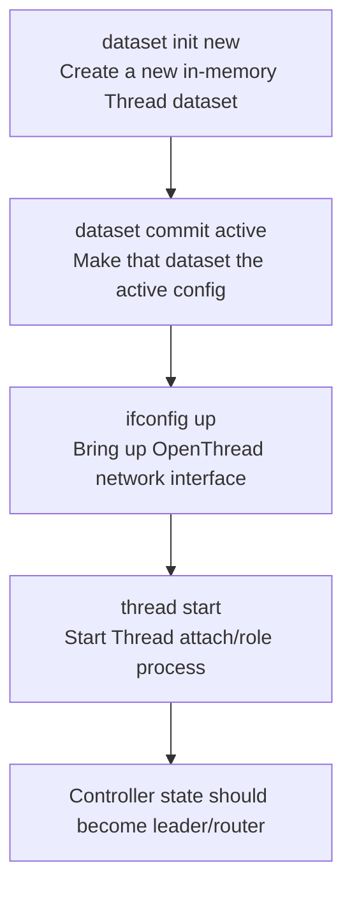

# Controller Console / Terminal Operation

This is the authoritative reference for operating the controller node over its
serial console. The controller node is the Matter controller/commissioner and
the local source of truth; the laptop/phone is only **operator ingress** (USB
serial, or the controller's private Wi-Fi AP). See
`docs/architecture.md#roles-and-responsibilities` for the role glossary.

> Maintenance rule: whenever a console/shell command is added, renamed, or
> changed (new `esp_console_cmd_t`, new `matter esp ...` flow we rely on, or new
> arguments), update this file in the same change. This is enforced by
> `.cursor/rules/console-commands.mdc`.

## Opening The Monitor

The interactive shell is routed over the ESP32-C6 native USB Serial/JTAG port
(`CONFIG_ESP_CONSOLE_USB_SERIAL_JTAG`). From the controller-node project:

```bash
idf.py -p /dev/cu.usbmodem1101 monitor
```

- Exit the monitor with `Ctrl+]`.
- Run `monitor` in a native terminal (e.g. macOS Terminal.app). The Cursor
  integrated terminal is not a TTY, so the monitor cannot accept keyboard input
  there ("Monitor requires standard input to be attached to TTY").
- If the port is busy ("Resource temporarily unavailable"), close any other
  monitor holding it before reopening.
- Type `help` at the prompt to list every registered command.

## Log Verbosity

The build sets the default runtime log level to **WARN**
(`CONFIG_LOG_DEFAULT_LEVEL_WARN`) so the noisy `wifi:`, `chip[...]`, and
`OPENTHREAD` info lines do not bury the shell. `WARN`/`ERROR` still print. INFO
is compiled in (`CONFIG_LOG_MAXIMUM_LEVEL_INFO`), and `app_main` re-raises the
LED Orchestra tags so operator breadcrumbs stay visible:

- `lo_controller` — boot/ready and commissioning events
- `lo_wifi_ingress` — operator Wi-Fi AP/station status
- `lo_console` — the JSON payload sent for each `lo-*` command

`app_main` also re-raises the Matter commissioning tags to INFO so
`pairing ble-thread` is debuggable while `wifi:`/`OPENTHREAD:` stay quiet:

- `chip[CTL]` — commissioning controller stages (the `kFind...` step names)
- `chip[DIS]` — DNS-SD discovery / operational resolve over Thread
- `chip[SC]` — PASE/CASE secure-session establishment
- `chip[BLE]` — BLE link used for commissioning
- `chip[DL]` — device-layer Thread/BLE events

Without these raised, `pairing ble-thread` prints only `Done` (the success and
in-progress logs are INFO and would be hidden), making commissioning failures
look like silence. Lower them back toward WARN once commissioning is reliable.

To debug deeply, raise the level (e.g. `CONFIG_LOG_DEFAULT_LEVEL_DEBUG`) in
`menuconfig` / `sdkconfig.defaults` and rebuild, or add an
`esp_log_level_set(...)` call.

## Built-in Command Groups

These groups are registered in `main/app_main.cpp` and are reached under the
`matter` root command:

| Command group | Purpose |
| --- | --- |
| `matter esp controller ...` | Commissioning and Matter cluster invokes (pairing, invoke-cmd). |
| `matter esp ot_cli ...` | OpenThread CLI: create/inspect the Thread dataset and bring Thread up. |
| `matter esp diagnostics ...` | Device diagnostics. |
| `matter esp factoryreset` | Wipe fabric/credentials and start clean. |

The commissioner starts with fabric id `112233`, controller node id `1`, and
listen port `5580` (see `controller.init(...)` in `app_main.cpp`).

## LED Orchestra Commands

Registered in `main/led_orchestra_console.cpp`. They send the custom cluster
`0xFFF1FC00`. Destination is a Matter node id (unicast) or a group id; the
all-nodes group is `0x0001`. Effect ids: `0` off, `1` solid, `2` rainbow,
`3` fibonacci (per-pixel R/G/B are consecutive Fibonacci numbers mod 256 down the
strip; scrolls with `speed`, ignores the RGB fields), `4` aurora breathe (soft
overlapping color waves with a breathing intensity curve; scrolls with `speed`,
ignores the RGB fields).

```text
lo-set-scene <node-id> <endpoint-id> <effect-id> <rrggbb> <speed> <brightness> [sequence] [scheduled-start-ms]
lo-set-node-config <node-id> <endpoint-id> <orchestra-node-id> <segment-start> <segment-len> <total-leds> <led-gpio>
lo-sync-clock <node-id> <endpoint-id> [controller-time-ms]
lo-read-config <node-id> <endpoint-id>
```

- `lo-set-scene` — **unicast** to one node. Set effect, RGB (6 hex digits),
  speed, brightness. `sequence` auto-increments if omitted; `scheduled-start-ms`
  of `0` applies immediately, otherwise the node holds its current scene and
  switches at the synchronized start time (keep-last-valid; it does not blank
  while waiting). For a whole group use `lo-set-scene-group` (below) — a bare
  small id like `0x0001` here means **unicast node 1**, not a group.
  Immediate scenes are persisted to NVS (`scene persisted ...` in the node log)
  so the node resumes the correct visual after a power cycle.
- `lo-set-node-config` — provision a node's segment layout and LED GPIO. Unicast
  only (do not send to a group). The node persists this in NVS and reloads it at
  boot (`config loaded from NVS ...` / `config persisted ...` in the node log);
  a runtime GPIO change is still rejected because the strip driver is bound at
  boot.
- `lo-sync-clock` — push the controller clock; defaults to the controller's
  current uptime in ms if `controller-time-ms` is omitted.
- `lo-read-config` — read all LED Orchestra cluster attributes from a node in a
  single ReadRequest (current effect, segment layout, GPIO, firmware version,
  last-accepted sequence number). Results arrive asynchronously via `chip[TOO]`
  log lines. Use after `lo-set-node-config` + power cycle to confirm the
  persisted config loaded, or after `lo-set-scene` to verify the last sequence.
  Example: `lo-read-config 0x1234 1`.

The full field/tag contract lives in
`matter-prototype/cluster/led-orchestra.md`.

## Group Control

Real Matter group control. A group is **not** a small id on the wire: an
application group id `g` (`0x0001..0xFEFF`) is addressed as a NodeId in the range
`0xFFFFFFFFFFFF0000..FFFF`, encoded with `chip::NodeIdFromGroupId(g)`. The group
commands below do that encoding so the SDK dispatches a real groupcast; passing a
bare `0x0001` to a *unicast* command would instead target node 1. The all-nodes
group is `0x0001`.

```text
lo-add-group <node-id> <endpoint-id> [group-id] [group-name]
lo-set-scene-group <group-id> <effect-id> <rrggbb> <speed> <brightness> [sequence] [scheduled-start-ms]
lo-sync-clock-group <group-id> [controller-time-ms]
lo-scheduled-scene-group <group-id> <delay-ms> <effect-id> <rrggbb> <speed> <brightness> [sequence]
lo-show-group-help
```

- `lo-add-group` — enroll one node endpoint into a group via the standard Groups
  cluster (`0x0004`) AddGroup command (unicast, per node). `group-id` defaults to
  `0x0001`, `group-name` to `orchestra`. Membership is what makes a later
  groupcast reach that endpoint.
- `lo-set-scene-group` — groupcast `SetScene` to every enrolled node.
- `lo-sync-clock-group` — groupcast `SyncClock`; defaults to controller uptime.
- `lo-scheduled-scene-group` — compute `controller_uptime + delay` and groupcast
  a scheduled `SetScene`, so all segments flip together at one synchronized time.
  Pair it with a recent `lo-sync-clock-group` so every node's offset is aligned.
- `lo-show-group-help` — print the one-time group-enablement sequence below.

### One-time group key + enrollment setup

Matter groupcast is encrypted with a group key. Both the controller **and** each
node need that key, and each node endpoint needs to be a group member. Run once:

1. Controller-side group keyset (esp-matter built-ins, already registered by
   `controller_register_commands()`):

   ```text
   matter esp controller group-settings add-keyset 0x0042 0 0xFFFFFFFFFFFFFFFF <32-hex-epoch-key>
   matter esp controller group-settings bind-keyset 0x0001 0x0042
   matter esp controller group-settings add-group   0x0001 orchestra
   ```

   `0x0042` is the keyset id, `0` is the TrustFirst policy, the 16-byte epoch key
   is 32 hex chars (dev/test value only — production rotates real keys through
   the Kubernetes control plane). `0x0001` is the application group id.

2. Per node (after commissioning) — use
   [`matter-prototype/s3-h2-hub-validation/lo-provision-group-member`](/Users/sadikyamin/developer/led-orchestra/matter-prototype/s3-h2-hub-validation/lo-provision-group-member:1)
   to print the exact commands, or run the equivalent sequence manually:

   ```text
   matter esp controller invoke-cmd <node> 0 0x003F 0x00 {"0:OBJ":{"0:U16":66,"1:U8":0,"2:BYT":"0NHS09TV1tfY2drb3N3e3w==","3:U64":1,"4:NULL":null,"5:NULL":null,"6:NULL":null,"7:NULL":null}}
   matter esp controller write-attr <node> 0 0x003F 0x00 [{"0:ARR-OBJ":[{"1:U16":1,"2:U16":66}]}]
   lo-add-group <node> 1 0x0001 orchestra
   matter esp controller write-attr <node> 0 0x001F 0x0000 [{"0:ARR-OBJ":[{"1:U8":5,"2:U8":2,"3:ARR-U64":[112233],"4:NULL":null},{"1:U8":3,"2:U8":3,"3:ARR-U64":[1],"4:ARR-OBJ":[{"0:U32":4294048768,"1:U16":1}]}]}]
   ```

   The node `KeySetWrite` payload is the `GroupKeySetStruct`: keyset `0x0042`,
   TrustFirst policy, epoch key 0 = the same 16-byte key encoded as base64
   (`d0d1…dedf` hex → `0NHS09TV1tfY2drb3N3e3w==`), and epoch start time `1`.
   The `GroupKeyMap` entry maps group `0x0001` → keyset `0x0042`. For
   `write-attr`, list attributes need the wrapper object
   `[{"0:ARR-OBJ":[...]}]`.

   The ACL write preserves the commissioner as a CASE/Administer subject
   (`112233` = controller node `0x1B669`) and adds group `0x0001` as a
   Group/Operate subject targeted at endpoint `1`, custom cluster `0xFFF1FC00`.
   For Access Control writes, the group subject is the **bare group id** (`1`);
   the stack converts it internally to `chip::NodeIdFromGroupId(1)`. If the
   controller node id differs on a given bench, change the CASE subject value or
   use the helper's `--admin-node-id` flag.

   All four node-side steps are required. Without `KeySetWrite`/`GroupKeyMap`,
   the node cannot decrypt/accept the groupcast. Without `lo-add-group`, it will
   not join the Matter multicast address. Without the ACL entry, it receives the
   groupcast but logs `AccessControl: denied` and keeps the last valid scene.

3. Power-cycle at least one provisioned node, then confirm a single
   `lo-set-scene-group 0x0001 ...` still drives it.

4. Drive all nodes with one command: `lo-set-scene-group 0x0001 ...`.

## OTA Provider Commands (Phase 7, build-gated)

These are registered **only** when the controller is built with
`CONFIG_LED_ORCHESTRA_ENABLE_OTA_PROVIDER=y` (off by default; see the Phase 7
runbook). They drive the local Matter OTA Provider.

```text
lo-ota-status
lo-ota-enable <node-id> [once]
lo-ota-disable <node-id>
lo-ota-set-image <uri-or-path> <software-version> <version-string> <size>
```

- `lo-ota-status` — show provider state + the recorded local image candidate.
- `lo-ota-enable` / `lo-ota-disable` — allow/deny a specific node's OTA (default
  is DENY; a node must have sent a QueryImage once for an enable to take effect).
- `lo-ota-set-image` — record the local image the hub intends to serve. Serving
  the bytes needs a hub-local image endpoint (the stock provider fetches over
  HTTP from the candidate URL) — see the Phase 7 runbook for the remaining
  offline plumbing. Offline-first: never a DCL/internet URL in the product path.

## Typical Bring-up Flow

1. `idf.py -p <port> monitor`, wait for `LED Orchestra controller node ready`.
2. `matter esp ot_cli ...` — initialize/inspect the Thread dataset and start
   Thread; capture the active operational dataset TLVs.
3. `matter esp controller pairing ble-thread <node-id> <dataset-tlvs> <pincode> <discriminator>`
   to commission an LED node into the private fabric (`lo_controller` logs
   `commissioning complete`).
4. `lo-set-scene <node-id> 1 2 00ff00 40 200` and confirm the physical LEDs
   change.
5. Repeat pairing for the second LED node, then drive both with a group-id
   `lo-set-scene` to validate the mesh.

## What The `ot_cli` Bring-up Commands Do

When bringing Thread up manually on the controller, these commands run in this
order:

```text
matter esp ot_cli dataset init new
matter esp ot_cli dataset commit active
matter esp ot_cli ifconfig up
matter esp ot_cli thread start
```



Purpose of each command:

- `dataset init new` — creates a fresh operational dataset (channel, PAN ID,
  network key, etc.) in memory.
- `dataset commit active` — commits that dataset as the active one the stack
  will use.
- `ifconfig up` — enables the Thread network interface.
- `thread start` — starts Thread protocol state machine so the device can
  attach and take a Thread role.

Verify Thread is ready before commissioning LED nodes:

```text
matter esp ot_cli state
matter esp ot_cli dataset active -x
```

Good controller states are `leader` or `router`. `detached` means the Thread
interface is up but the controller has not attached yet; rerun `ifconfig up`,
`thread start`, wait a few seconds, then check `state` again.

Before pairing Thread devices, the controller also needs OpenThread
border-router/SRP-server support. Verify the SRP server command exists:

```text
matter esp ot_cli srp server state
```

If this returns `Error 35: InvalidCommand`, rebuild the controller with
`CONFIG_OPENTHREAD_BORDER_ROUTER=y` (and the matching local-only border-router
settings in `matter-prototype/controller-node/sdkconfig.defaults`).

When to run all four vs only two:

- First-time setup, changed network, or erased NVS: run all four.
- Normal reboot with persisted dataset: usually run only `ifconfig up` and
  `thread start`.

## BLE Thread Pairing Requirement

The ESP-Matter controller command:

```text
matter esp controller pairing ble-thread <node-id> <dataset-tlvs> <pincode> <discriminator>
```

requires the controller firmware to be built with:

```text
CONFIG_ENABLE_ESP32_BLE_CONTROLLER=y
```

Without it, the shell prints:

```text
Please enable ENABLE_ESP32_BLE_CONTROLLER to use pairing ble-thread command
```

The pairing command uses BLE only for commissioning. After commissioning, the LED
node joins the Thread dataset and normal LED control runs over Matter/Thread.

If pairing reaches:

```text
Error on commissioning step 'kFindOperationalForStayActive': 'Error CHIP:0x00000003'
```

then BLE commissioning likely handed the Thread dataset to the LED node, but the
controller could not discover the node's operational Matter service over Thread.

> **Historical bring-up context — not current setup guidance.** The steps below
> document the single-SoC investigation that led to the border-router decision.
> The current direction is a real border router (the S3+H2 one-board hub; all-C6
> split as fallback); see
> [`controller-topology-adr.md`](controller-topology-adr.md). Do **not** treat the
> on-device-resolution config below as the recommended setup.

To make the single SoC *attempt* on-device resolution (it is both the Matter
commissioner and the Thread SRP/DNS-SD server), the controller was built with all
three of:

```text
CONFIG_OPENTHREAD_BORDER_ROUTER=y   # SRP server so nodes can publish services
CONFIG_OPENTHREAD_SRP_CLIENT=y      # on-device commissioner registration
CONFIG_OPENTHREAD_DNS_CLIENT=y      # on-device operational discovery / resolve
```

With all three enabled and the SRP server `running`, commissioning advanced past
the earlier `0x00000003` state but then failed with a **timeout** instead:

```text
Error on commissioning step 'kFindOperationalForStayActive': 'Error CHIP:0x00000032'
```

**Confirmed finding (2026-06): a single native-Thread ESP32-C6 cannot resolve
its own operational nodes, so it cannot be a self-contained commissioner.** In a
captured commissioning the LED node attached to Thread (answered ping in ~44 ms),
completed BLE commissioning through `AddNOC`, and registered
`...-0000000000000002._matter._tcp` in the controller's SRP registry. The
controller's own DNS-SD probes then timed out (`Error 28: ResponseTimeout`)
against the node's ML-EID, the anycast locator, and its RLOC; switching the SRP
entry from unicast to anycast did not help. So the SRP server *stores* the
record but nothing *answers* the controller's DNS-SD query: an offline single
SoC has no host-side mDNS / advertising-proxy layer, which is exactly the part a
real OTBR runs on its host.

`CONFIG_ENABLE_ROUTE_HOOK` was tested empirically (2026-06) and ruled out: the
controller was rebuilt and flashed with `CONFIG_ENABLE_ROUTE_HOOK=y`, brought to
Thread `leader` with the SRP server `running`, and `srp server service` listed a
real `_matter._tcp` operational record (the controller's own, with a valid AAAA
address `fd86:2be7:...`). Even so, `dns browse _matter._tcp.default.service.arpa`
on that same node still returned `Error 28: ResponseTimeout`. Route hook only
adds IPv6 routing, not a DNS-SD responder, so it does not close the gap.

This matches Espressif's guidance that a Thread Border Router is mandatory to
bridge controller<->device (esp-matter issue #1559). The supported path uses a
separate OTBR (esp-thread-br on a host + RCP, or a Linux/Pi OTBR) that owns the
Thread network and DNS-SD; the controller joins that network and resolves nodes
through it. See `docs/architecture.md` and `docs/matter-thread.md` for that
direction.

Prototype credential warning:

- For Phase 3, multiple LED nodes may share the same test setup PIN and
  discriminator, but commission them one at a time so the controller knows which
  physical board is being assigned to each Matter node id.
- The Matter node id (`2`, `3`, etc.) is assigned by the controller during
  commissioning and is the address used by `lo-set-scene`.
- The LED Orchestra node/segment identity is assigned separately with
  `lo-set-node-config`.
- `led-gpio` is only the local ESP32 pin driving that board's LED strip. It is
  not a device identity; two boards can both use GPIO2 because each board has
  its own GPIO2.
- Before production or public Matter ecosystem use, replace shared test
  credentials with per-device factory data / unique setup payloads (QR/manual
  codes), and document the manufacturing flow.
