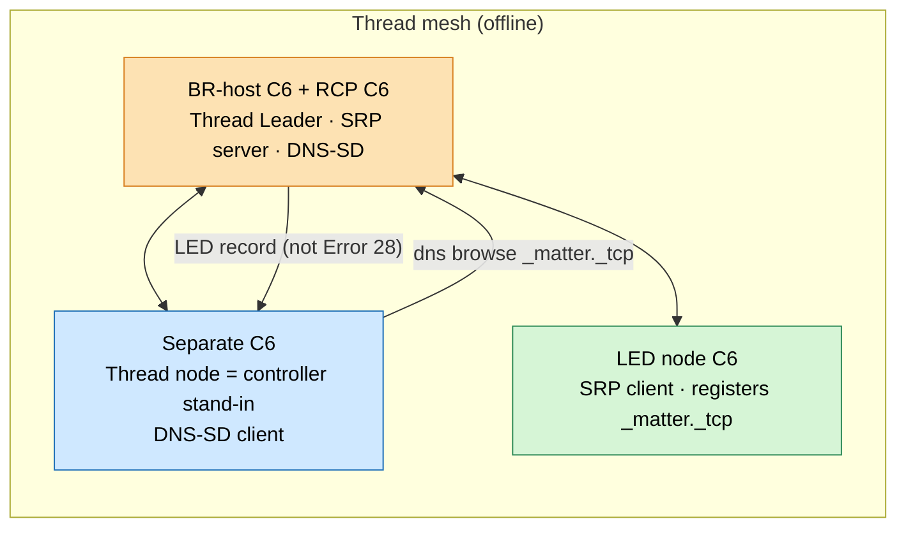

# Controller / Border-Router Topology Validation

This is the experiment that decides the production controller/border-router
topology. It turns the validation-gated decision in
[`controller-topology-adr.md`](controller-topology-adr.md) into a concrete,
**quantitative** pass/fail test. The result selects Option 2, Option 3, or
Option 4 — it is not run to confirm a foregone conclusion.

The gate exists because of the failure recorded in
[`debugging-journal.md`](debugging-journal.md): a single ESP32-C6 acting as
Matter commissioner **and** its own infra-less SRP/DNS-SD owner could not
resolve its own operational nodes (`dns browse` → `Error 28: ResponseTimeout`).
The fix is a real border router that owns SRP/DNS-SD. What is *not yet proven* is
how much of the controller can be co-located with that border router on one C6.

## Decision Ladder Under Test

| Option | Topology | Role in the ladder |
| --- | --- | --- |
| **2** | Hub C6 (Matter controller + esp-thread-br host + thin K8s gateway) + RCP C6 | Preferred production target **if** the hub validates within headroom |
| **3** | Controller C6 + BR-host C6 + RCP C6 (all-C6) | Fallback if the hub C6 is resource-constrained but the C6 BR path is sound |
| **4** | Pi/Linux `ot-br-posix` + RCP/dongle | Final fallback only if the C6 BR path itself is not stable |

The **locked production ladder is 2 → 3 → 4**; each rung is chosen only when the
rung above it fails its gate. Option 1 (a single C6 doing everything) sits
*outside* this ladder: its infra-less form is ruled out, and an esp-thread-br
variant survives only as an optional "drop-the-RCP" optimization attempted after
Option 2 validates (see the follow-on below and the ADR's Alternatives
Considered).

Option 3 wiring rule (load-bearing): the separate controller C6 joins the
BR-owned Thread mesh over its **own 802.15.4 radio** and uses the BR only for
SRP/DNS-SD and border routing. Controller→LED control stays on Thread/Matter.
It must **not** carry live LED control over Wi-Fi. See
[`architecture.md`](architecture.md#decision-led-nodes-stay-thread-only).

## Hardware And Roles

| Stage | Boards | Notes |
| --- | --- | --- |
| 0 | BR-host C6 + RCP C6, 1 LED node C6, 1 separate "client" C6 | **Split** config. The client C6 is a controller stand-in: a Thread node that is **not** the BR. Isolates the BR's discovery from co-location. |
| 1 | Hub candidate = controller **co-located onto the BR host** (radio on the RCP), 1 LED node | First Option 2 test: on-board self-resolution via the BR's advertising proxy. Commission one node, send one scene. |
| 2 | Stage 1 set scaled to ~20 LED nodes | Real (or, where unavoidable, simulated) discovery/SRP load. |
| 3 | Stage 2 set | Soak + power-yank/reboot recovery with heap tracking. |
| 4 | Stage 3 set; hub also runs the thin K8s bundle gateway | Re-measure headroom with all three roles live. |

**Stage 0 is the only deliberately *split* stage** (separate client, to isolate
the BR's discovery). **From Stage 1 on, the controller co-locates onto the BR
host = the Option 2 Hub candidate.** If a co-located stage fails — on-board
discovery *or* heap/stability — fall back to Option 3, which is exactly the
Stage 0 split configuration.

## Pass/Fail Metrics (Quantitative Gate)

Record these for every stage. Targets are **initial** — baseline them on the
first clean run, then ratify the thresholds. "Vibes" do not pass the gate; a
number does.

| Metric | How measured | Initial target | Notes |
| --- | --- | --- | --- |
| Min free heap | `esp_get_minimum_free_heap_size()` sampled over the run | ≥ 48 KB sustained | Hard floor for stability headroom; baseline then set. |
| Largest free block | `heap_caps_get_largest_free_block(MALLOC_CAP_DEFAULT)` | ≥ 24 KB sustained | Guards against fragmentation even when total free looks OK. |
| Heap drift | Min free heap trend over the soak | No monotonic downward drift over 72 h | Slow leaks/fragmentation are the silent field failure. |
| Soak uptime | Continuous run without crash/watchdog/reboot | ≥ 72 h | Stages 3–4. |
| Reboot recovery | Power-yank → rejoin → rediscover → resume control | 100% over ≥ 20 cycles, first scene ≤ 60 s | Unclean power-down is the real deployment event. |
| Operational discovery | `dns browse` / CASE resolution success rate | 100% over ≥ 50 attempts | Includes re-resolution after node drop/rejoin. |
| Scale | Nodes commissioned and group-controllable | 20 nodes; group `SetScene` reaches all within latency budget | Stage 2+. |
| Stored bundles | Representative bundle cache resident | Present without pushing heap below floor | Stage 4. |
| Flash usage | App + NVS + bundle cache + placeholder OTA image vs. partition | ≥ 25% partition headroom | Drives the 8/16 MB hub decision below. |

## Staged Experiment

### Stage 0 — BR Fixes Discovery, Proven From a Separate Client (primary go/no-go)

This is the cleanest mapping back to the original bug. The 2026-06-02 failure was
**colocated self-resolution**, so the proof must come from a *different* node
resolving *through* the border router — never from the BR resolving its own
record.



Sequence:

```text
1. BR-host C6 + RCP C6 owns Thread / SRP / DNS-SD (Leader, SRP server running).
2. A separate C6 joins as a Thread client/controller (its own 802.15.4 radio).
3. An LED node registers _matter._tcp via SRP with the BR.
4. The separate client runs: dns browse _matter._tcp.default.service.arpa.
5. PASS: the browse returns the LED record.
   FAIL: Error 28: ResponseTimeout (the original symptom).
```

**Gate:** the separate client resolves the LED's operational record through the
BR. If this fails, the C6 esp-thread-br DNS-SD path itself is not doing the job
→ jump to **Option 4** (`ot-br-posix`); no further C6 staging is worthwhile.

**Execution.** The concrete, reproducible runbook — board roles, RCP↔host UART
wiring, per-board build/flash commands, the bring-up sequence, expected healthy
logs, the exact `dns browse` command, and a pass/fail evidence template — lives
in
[`../matter-prototype/stage0-br-validation/README.md`](../matter-prototype/stage0-br-validation/README.md).
The four boards map to: BR-host C6 (`ot_br`) + RCP C6 (`ot_rcp`) for the border
router; the existing `led-node` (unchanged) as the SRP publisher; and the
`controller-node` app — built with its border router/SRP server **off**
(`sdkconfig.client.defaults`) — as the *separate client / controller stand-in*,
i.e. exactly the Option 3 controller role used here to isolate the BR's
discovery. Only the BR-host and client need a serial console at runtime, so the
run fits a two-port host.

Per the offline product shape, Stage 0 runs the **backbone-less BR first**. A
**Wi-Fi-backbone BR** is kept only as a *diagnostic fallback* (run on FAIL) to
localize whether a failure is the border-router init / advertising-proxy / OMR
path rather than the C6 BR path itself; that Wi-Fi is the BR-host's backbone only
and carries no LED control. The committed config overlays
(`sdkconfig.rcp.defaults`, `sdkconfig.rcp-sidepins.defaults`,
`sdkconfig.br-host.defaults`, `sdkconfig.br-host-wifi.defaults`,
`sdkconfig.client.defaults`) plus `rebuild-sidepins.sh` capture the exact
non-default settings and the XIAO side-pin BR/RCP patch used in the hardware
run.

**Status (2026-06-04):** Stage 0 hardware run completed with the XIAO side-pin
BR/RCP build (`D6/GPIO16` TX crossed to `D7/GPIO17` RX). The BR-host reached
`leader`, the SRP server reached `running`, `rcp version` succeeded, the
separate client joined the BR mesh, and the client resolved the real LED
`_matter._tcp` service through the BR:

```text
525E53F22D34B3AE-0000000000000002
Port:5540
Host:120633A3E1E984B0.default.service.arpa.
HostAddress:fd42:957b:9cb6:4fbc:d25c:e012:d49c:57d6
```

This retires the original BR DNS-SD `Error 28: ResponseTimeout` failure for the
separate-client topology.

The follow-on operational `error 32` (`0x32` = `CHIP_ERROR_TIMEOUT`) is now also
resolved, so **Stage 0 is a full PASS (discovery + operational CASE).** Root
cause: single-C6 radio contention — the commissioner was running its operator
Wi-Fi softAP **and** BLE **and** native 802.15.4 on one 2.4 GHz PHY, starving
CHIP's operational discovery/CASE. Fix: disable the operator Wi-Fi AP on the
commissioner build (`sdkconfig.client.defaults` →
`CONFIG_LED_ORCHESTRA_OPERATOR_WIFI_MODE_DISABLED=y`, plus OT buffers 128 as
headroom). Validated **operationally without re-commissioning** (the node stayed
on the fabric — `error 32` fires after device commit): the controller resolved
node `2` through the BR, established a CASE session (`read-attr`, no timeout), and
a custom-cluster `SetScene` rendered solid red on the LED. The OT message pool
peaked at `14/128`, so removing the Wi-Fi PHY — not the buffer bump — was the
operative fix. Full detail + decisive evidence: the 2026-06-04 entry in
[debugging-journal.md](debugging-journal.md). Stage 1 is unblocked.

### Stage 1 — Minimal Controller, One Node

Co-locate minimal Matter controller behavior onto the BR host (the Option 2 Hub
candidate; radio stays on the RCP): commission one LED node over BLE→Thread and
send a single `SetScene` over the custom cluster (`0xFFF1FC00`). No bundle logic,
no K8s.

**Gate:** the *co-located* controller resolves the node through its on-board BR,
commissioning completes through operational CASE (the step that timed out
before), `SetScene` renders, and metrics stay within target. If on-board
discovery fails here even though Stage 0 passed → fall back to Option 3.

### Stage 2 — Scale To ~20 Nodes

Commission to the target node count and exercise unicast provisioning plus group
`SetScene` (group `0x0001`) for all-node changes.

**Gate:** all nodes commissioned and group-controllable within the latency
budget; discovery success stays 100%; heap stays above floor at scale.

### Stage 3 — Soak, Power-Yank, Reboot Recovery

Run ≥ 72 h continuously. Interleave ≥ 20 hard power cycles of the hub. After each
cycle, confirm the mesh re-forms, nodes re-resolve, and control resumes within
the recovery budget. Track heap drift across the whole window.

**Gate:** uptime, reboot-recovery, heap-drift, and discovery metrics all pass.

### Stage 4 — Add The Thin K8s Bundle Gateway

Add the bundle ingress/cache only (receive an already-validated bundle, store it,
relay/activate over Matter). **Do not** port scheduling, validation, authoring,
or libraries onto the C6 — that logic stays in Kubernetes.

**Gate:** all Stage 3 metrics still pass with the gateway and a resident bundle
cache live. This is the real Option 2 acceptance gate.

### Optional Follow-On — Option 1b (drop the RCP)

Only after Option 2 fully validates, you may probe whether the same co-located
stack holds on a **single C6 with no RCP** (esp-thread-br on the native 802.15.4
radio). The DNS-SD path is identical to Option 2 — the RCP only offloads radio
work — so this tests *one thing*: whether one C6 has the CPU/heap headroom
without the radio offload. It is **low-confidence and optional**; the RCP is the
safe default and Option 1b is never assumed. Re-run the full soak before trusting
a pass.

## Decision Rules

```text
Stage 0 FAIL (separate client can't resolve through the BR) -> Option 4 (Pi / ot-br-posix)
Stage 1+ co-located Hub FAILS (on-board discovery OR heap/stability) -> Option 3 (split, all-C6)
Stages 0-4 PASS within headroom -> Option 2 (Hub C6 + RCP)  [target]
```

Option 1 is **not** part of this gated ladder: 1a (infra-less) is ruled out, and
1b (drop-the-RCP) is the optional follow-on above, attempted only after Option 2
passes.

Option 3, if selected, reuses the Stage 0 split configuration: the controller
moves to its own C6 and joins the BR's Thread network over its native radio (per
the wiring rule above), which is expected to restore the headroom the co-located
hub lacked.

## Flash Sizing

Controller + esp-thread-br + Wi-Fi + bundle cache + a served OTA image will
strain a 4 MB part. Plan the hub on an **8 or 16 MB C6**; the LED nodes can stay
4 MB. This keeps the build "all-C6" (one chip family, one toolchain) while sizing
the hub for its larger job. The Stage 4 flash-headroom metric confirms the part.

## Non-Goals

- No heavy scheduling, validation, authoring, or library logic on the C6.
- No live LED control over Wi-Fi in any option (Option 3 included).
- No internet/cloud dependency for rendering already-loaded scenes.

## Related Docs

- [`controller-topology-adr.md`](controller-topology-adr.md) — the decision this
  experiment gates, with rationale and consequences.
- [`debugging-journal.md`](debugging-journal.md) — the discovery-timeout bug this
  retires.
- [`mesh-network.md`](mesh-network.md) — the confirmed border-router split and
  join/control sequence.
- [`matter-thread.md`](matter-thread.md) — custom cluster contract and BR
  decision.
- [`console.md`](console.md) — `ot_cli` Thread/SRP/DNS bring-up and `lo-*` scene
  commands used in these stages.
