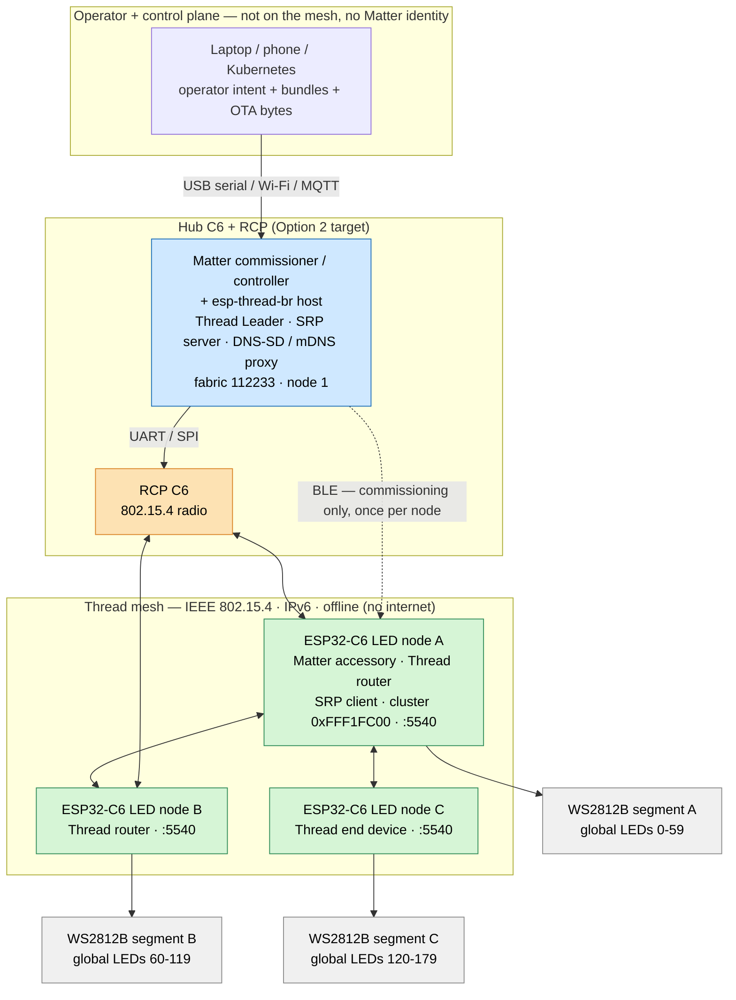
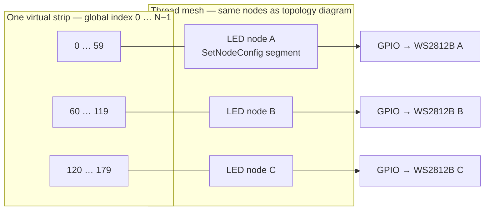
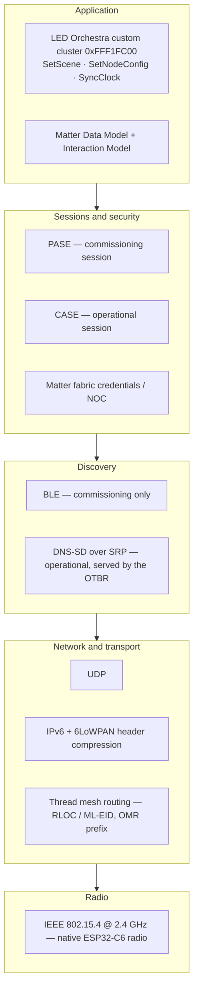
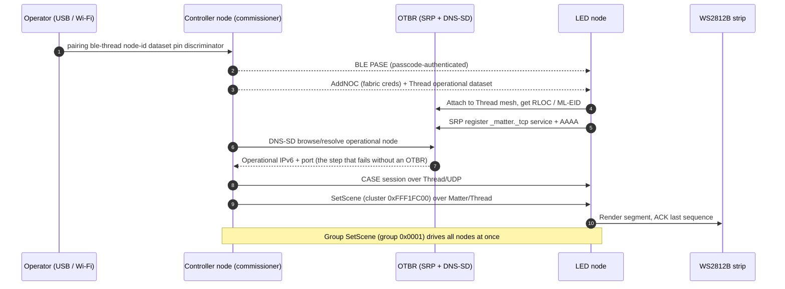

# Mesh Network

This document focuses on the **Thread mesh** that carries LED control: who is on
it, what radio/IP/Matter layers it is built from, and how a node goes from
"unprovisioned board" to "answering scene commands over the mesh." For the role
glossary (UI ingress vs. Matter controller vs. OTBR vs. OTA provider/requestor)
see [`architecture.md`](architecture.md#roles-and-responsibilities).

The mesh is **fully offline**: IEEE 802.15.4 radio, Thread IPv6, and Matter, with
no venue Wi-Fi, Ethernet, cloud, or internet. The operator's laptop/phone is not
on the mesh and holds no Matter identity; it only feeds the controller node over
USB serial or the controller's private Wi-Fi AP.

## Topology (Border Router Required)

Hardware bring-up confirmed (2026-06-02) that a single infra-less ESP32-C6
cannot be a self-contained Matter commissioner: it stores a node's `_matter._tcp`
SRP record but cannot answer its own DNS-SD query, so operational discovery times
out. The mesh therefore needs a real **OpenThread Border Router** that owns the
Thread network and DNS-SD.

The preferred target is **Option 2**: a **Hub C6** that co-locates the Matter
controller and the esp-thread-br host, with a dedicated **RCP C6** for the radio.
The diagram below shows that shape. Fallbacks split those roles onto separate C6s
(Option 3) or use a Linux/Pi `ot-br-posix` (Option 4) — the mesh roles are the
same, only where they run differs. See
[`controller-topology-adr.md`](controller-topology-adr.md) for the validation-
gated ladder, and [`debugging-journal.md`](debugging-journal.md) /
[`console.md`](console.md#ble-thread-pairing-requirement) for the evidence.

Reading the diagram:

- **Solid links inside the mesh box are 802.15.4 radio links.** Thread maintains
  these automatically; the layout above is illustrative, not fixed. Routers form
  a partial mesh and forward for each other, so node C can reach the Hub (through
  the RCP) over a multi-hop path with no single point of radio failure.
- **Thread roles are dynamic.** One device is elected Leader; here the Hub's
  border-router role owns the network. LED nodes attach as children that can
  promote to Routers (REEDs).
- **The operator path is out-of-band.** USB serial / the controller's private
  Wi-Fi softAP carry operator intent (and, in the OTA phase, OTA image bytes)
  into the hub only. That path is not Thread and not Matter.
- **BLE is commissioning-only.** The Hub uses BLE once per node to hand over
  fabric credentials and the Thread dataset, then all control runs over
  Matter/Thread. The dashed edge applies to every LED node at join time.
- **Each LED node renders one contiguous segment** of the single virtual strip;
  see [`architecture.md`](architecture.md#runtime-model). The installation
  scales to ~20 nodes — A/B/C are representative.
- **Fallback views.** Option 3 splits the Hub into a separate controller C6 and a
  separate BR-host C6 — both Thread nodes on this same mesh, with the controller
  joining over its own 802.15.4 radio and resolving through the BR. Option 4
  replaces the C6 border router with a Linux/Pi `ot-br-posix`. Mesh roles are
  identical; only where they run differs. See
  [`controller-topology-adr.md`](controller-topology-adr.md).

## Virtual Strip On The Mesh

Scene commands carry a **global LED index**; each node maps that index to pixels
on its local WS2812B segment. Thread/Matter carries the commands; the strip
wiring is local to each board.

Effects are pure functions of `(global_index, time_ms, …)`, so a rainbow or
wave can span segment boundaries even though each node only drives its own LEDs.

## Protocol Stack On The Mesh

Matter is the application/security model; Thread is the offline IPv6 mesh; IEEE
802.15.4 is the radio. LED nodes (and the Stage 0 separate client) run OpenThread
on their **native** 2.4 GHz radio (`RADIO_MODE_NATIVE`). The Option 2 Hub is
different: its esp-thread-br host drives a **separate RCP** over UART/SPI, so the
host runs the OpenThread stack against the RCP's radio, not a native one. Do not
carry the native-radio controller config into the Hub build.

The operator ingress (USB serial / Wi-Fi softAP) sits beside this stack, not
inside it: it terminates at the controller node and never reaches the Matter
fabric or the Thread radio.

## Join + Control Sequence

This is the path one LED node takes from power-on to rendering a scene, and it
shows exactly why the OTBR is required: the **operational discovery** step is the
one that timed out on a single ESP32-C6.

Notes:

- Steps 1-3 are **BLE commissioning**; steps 4-8 are **operational over Thread**.
  After step 8 the BLE link is no longer used for that node.
- Step 7 (`B-->>C`) is the discovery that an infra-less single SoC cannot satisfy
  for itself: the record exists in SRP storage, but nothing answers the
  controller's DNS-SD query. A real OTBR resolves it via its host mDNS /
  advertising-proxy layer.
- In the Option 2 target, the controller (C) and border router (B) are the same
  Hub board; Phase 4 Stage 0 first proves the split case (a *separate* client
  resolving through the BR) before trusting the co-located case. See
  [`controller-topology-validation.md`](controller-topology-validation.md).
- After commissioning, the controller addresses nodes by Matter node id
  (unicast) for provisioning, and by group id `0x0001` (multicast) for all-node
  scene changes.
- Each node keeps rendering its last valid scene if it loses contact with the
  controller, and re-syncs (scene + segment config + clock) when it reattaches.

## Resilience Properties

- **Mesh redundancy.** Thread routers self-heal: if one router drops, routes
  re-form around it as long as the partition stays connected. End devices
  reattach to another in-range parent.
- **Node independence.** A node that loses the mesh keeps showing its last valid
  scene; the rest of the strip keeps running. See the rendering invariants in
  [`architecture.md`](architecture.md#rendering-invariants).
- **Single infra dependency.** The OTBR owns DNS-SD, so commissioning *new*
  nodes (and CASE re-resolution) depends on it. Already-commissioned nodes that
  hold a live session keep taking commands without it. Treat OTBR availability as
  the main mesh-infrastructure risk to design around.

## Related Docs

- [`architecture.md`](architecture.md) — role glossary, runtime/virtual-strip
  model, override priority, OTA flow.
- [`matter-thread.md`](matter-thread.md) — ESP-Matter-over-Thread tradeoffs,
  custom cluster contract, and the confirmed border-router decision.
- [`console.md`](console.md) — the `ot_cli` Thread bring-up commands, pairing,
  and the `lo-*` scene commands used over the mesh.
- [`debugging-journal.md`](debugging-journal.md) — the discovery-timeout
  investigation that established the border-router split.
